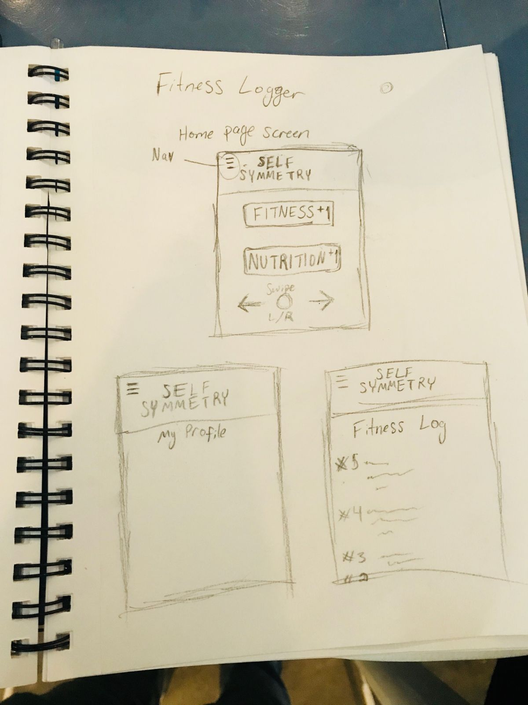
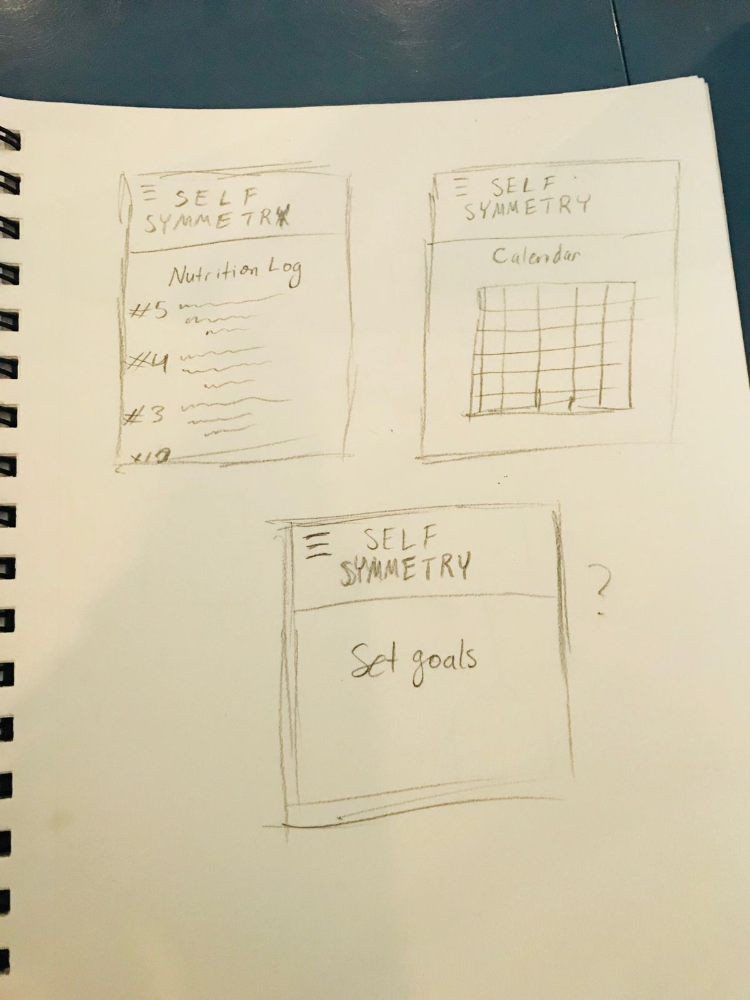
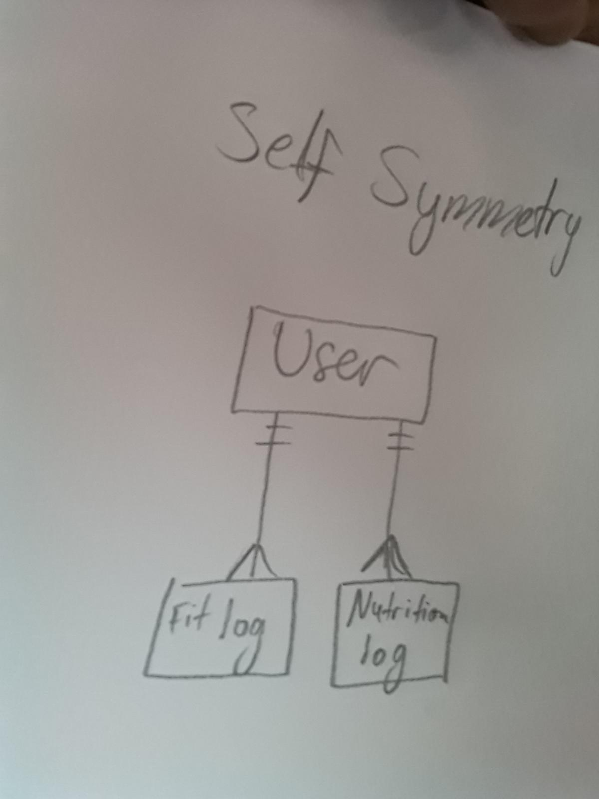

# Self-Symmetry

Self-Symmetry is a logbook application to help the user track their fitness and nutrition.

## Links
- https://github.com/ahkiemcm/Self-Symmetry [GitHub]
- https://trello.com/b/aflzqn7V/x-mehn-app [Trello-Board]
- https://guarded-beyond-96741.herokuapp.com/ [Heroku-Site]

## WireFrames

## ERD

    * User: one-to-many 
        * Name: String
        * Age: Number
        * Height: Number 
        * Weight: Number
        * Fitness Purpose: String
        * Logs: [ {Workout log}, {nutrition log} ]

    * Workout Log:  many- to-one { }
        * Date/Time: Number
        * Exercises: [ { 
            * - workout: String, 
            * - reps: Number, 
            * - sets: Number, 
            * - difficulty: Number (level 1 -5) 
		} ]

    * Nutrition Log: many- to -one { }
        * Date/Time: Number
        * Last meal: [ String ]
        * Last beverage: String
        * Water intake: Number
        * How do you feel?: String

## Contributing

